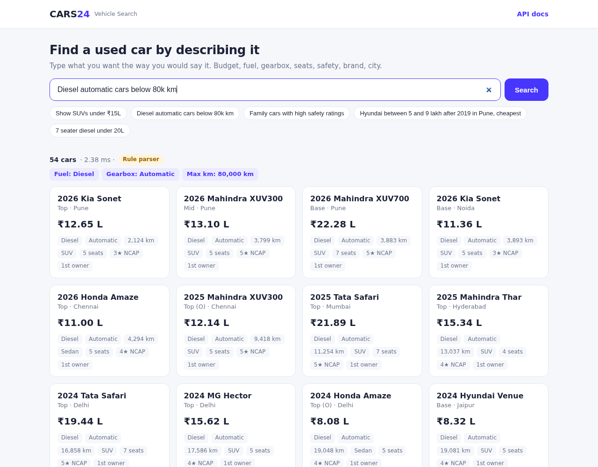
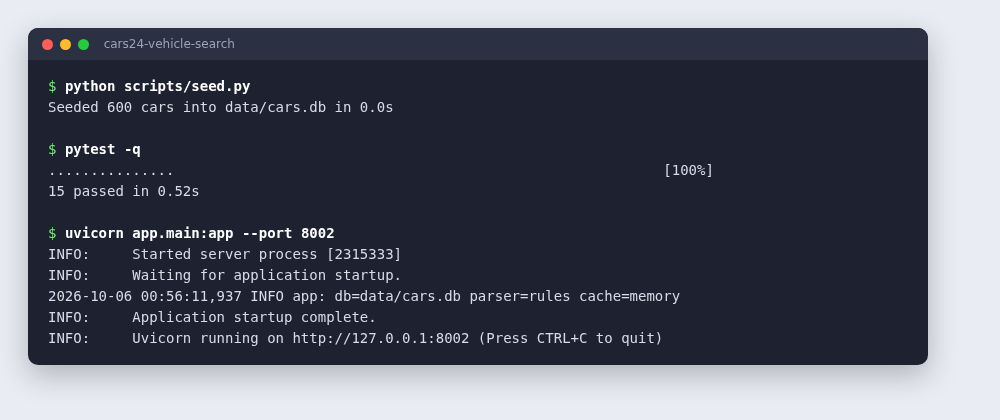
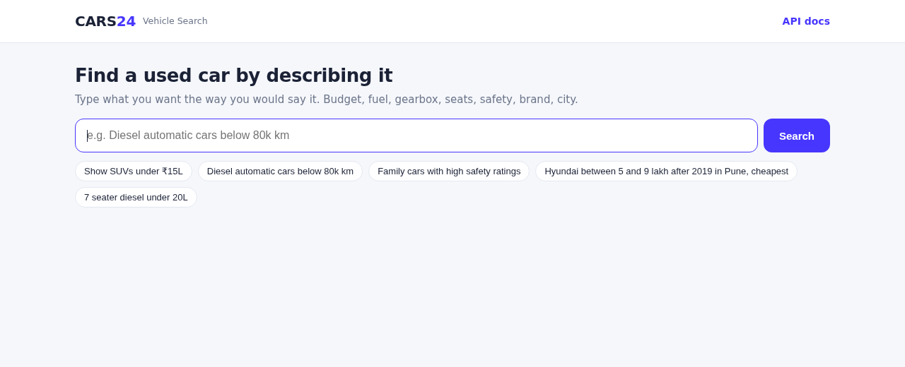
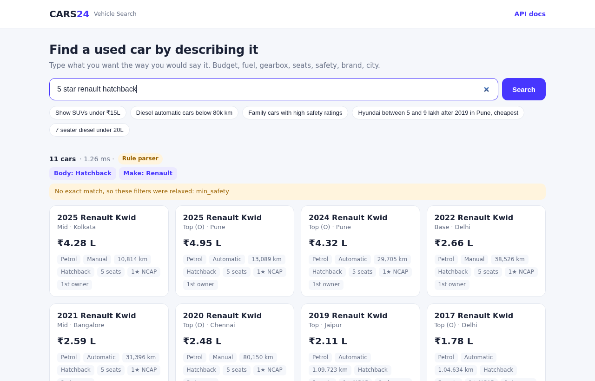
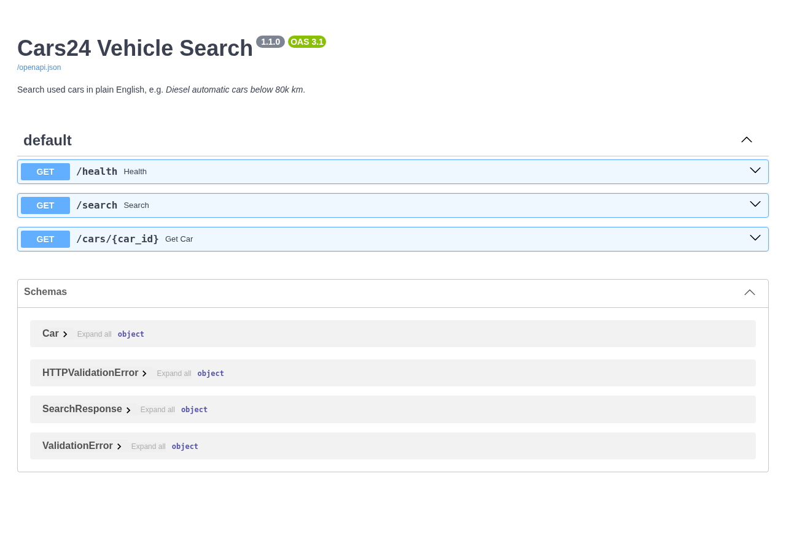
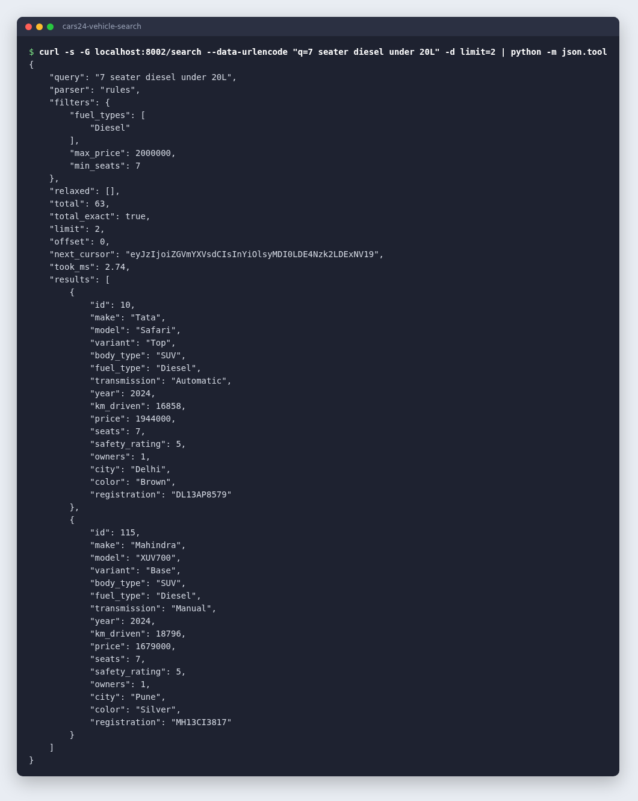
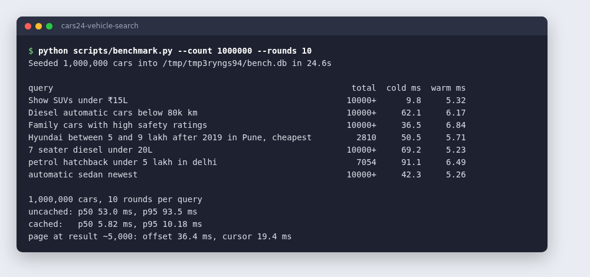

# Cars24 Vehicle Search

Search a used-car catalogue in plain English.

```
GET /search?q=Diesel automatic cars below 80k km

filters  → fuel: Diesel, gearbox: Automatic, max km: 80,000
results  → 54 matching cars, newest first
```

Built for the Cars24 Backend Engineering assignment, **Problem 2: AI Vehicle Search Engine**. The service turns a free-text query into structured filters, runs them against the catalogue, and returns matching cars along with the filters it understood.



**Stack:** Python 3.10+, FastAPI, SQLite, Anthropic Claude API (optional), optional Redis.

---

## Contents

- [Two ways to parse a query: AI or rules](#two-ways-to-parse-a-query-ai-or-rules)
- [How to run](#how-to-run)
- [How to search](#how-to-search)
- [API](#api)
- [Scalability](#scalability)
- [Project structure](#project-structure)
- [Configuration](#configuration)
- [Docker and deployment](#docker-and-deployment)
- [Tests](#tests)

---

## Two ways to parse a query: AI or rules

The hard part of this problem is understanding the query. The service has two parsers and picks one automatically.

| | **AI parser (recommended)** | **Rule parser (fallback)** |
|---|---|---|
| Needs | `ANTHROPIC_API_KEY` | Nothing |
| How it works | Claude reads the query and returns filters that are validated against a fixed schema | Regular expressions for common phrasings |
| Handles | Free-form language, negation ("not diesel"), number words ("twelve lakh"), context ("family of 7"), synonyms ("no gears" = automatic) | Keywords and standard formats such as "under 15L", "80k km", "7 seater", "after 2019" |
| Used when | A key is set | No key is set, or the AI call fails or times out |

> **For the best results, set an API key.** Without a key everything still works, but the rule parser only understands the phrasings it was written for. The response field `parser` (and the badge in the UI) shows which parser handled each query.

These are real outputs from the rule parser, for queries it gets wrong or only partly right:

| Query | Rule parser output | What the query actually means |
|---|---|---|
| an SUV that is not older than 3 years, not diesel | SUV, **Diesel** | SUV, year ≥ 2023, any fuel except diesel |
| Maruti or Toyota automatic, max 1.2 lakh km | Maruti/Toyota, automatic, **max price ₹1.2L** | Maruti/Toyota, automatic, max **120,000 km** |
| something for a family of 7 that runs on diesel, budget twelve lakh | Diesel, **5+ seats**, sorted by price, no budget | Diesel, 7+ seats, max price ₹12L |
| a car my wife can drive easily, no gears please | *(nothing)* | Automatic |

The AI parser is given the same conventions (1L = ₹1,00,000, "family car" = 5+ seats, "safe" = 4+ NCAP stars and so on) and because it reads the whole sentence rather than matching keywords, it can handle queries like these. Either way the LLM only produces filters. It never writes SQL and never decides what is in the results (see [docs/DESIGN.md](docs/DESIGN.md)).

---

## How to run

### 1. Install

```bash
git clone git@github.com:Ashutoshpandey29/CARS-24-AI-VEHICLE-SEARCH-.git
cd CARS-24-AI-VEHICLE-SEARCH-
python3 -m venv .venv
source .venv/bin/activate
pip install -r requirements-dev.txt
```

### 2. Create the catalogue

```bash
python scripts/seed.py            # 600 cars into data/cars.db
```

The generator is deterministic. It uses 41 real models from 11 brands, with real body types, seat counts, fuel and gearbox options and NCAP ratings, spread over 11 cities with matching registration plates. Prices start from each model's ex-showroom price and depreciate with age, mileage, variant, fuel and gearbox. Pass a number for a bigger catalogue, e.g. `python scripts/seed.py 1000000`.

### 3. Turn on the AI parser (recommended)

```bash
cp .env.example .env
# open .env and set ANTHROPIC_API_KEY=sk-ant-...
```

Skip this step to run with the rule parser only.

### 4. Start the server

```bash
uvicorn app.main:app --reload --env-file .env    # or without --env-file if you skipped step 3
```

If port 8000 is taken, add `--port 8002` (or any free port) and use that port in the URLs below.

### 5. Open it

| URL | What it is |
|---|---|
| http://localhost:8000 | Search page |
| http://localhost:8000/docs | Interactive API docs (Swagger) |
| http://localhost:8000/health | Health check, also shows which parser is active |

Seeding, tests and server start in one terminal:



The `Makefile` has shortcuts for the same steps: `make install`, `make seed`, `make run`, `make test`, `make bench`, `make docker`.

---

## How to search

### Search page

Open http://localhost:8000, type a query or click an example. The page shows:

- how many cars matched and how long the search took
- which parser handled the query (**AI parser** or **Rule parser**)
- the filters it understood, as chips under the result count
- the cars, with **Show more** at the bottom for the next page



When nothing matches exactly, the service drops the least important filters one at a time and tells you which ones it dropped. Here the only Renault hatchback (the Kwid) has a 1-star rating, so the 5-star requirement was relaxed:



Budget, fuel, body type, make and city are never relaxed. Only safety rating, km driven and year are, in that order.

### Swagger UI

Open http://localhost:8000/docs, click **GET /search**, then **Try it out**, type a query in `q` and press **Execute**.



### curl

```bash
curl -s -G localhost:8000/search --data-urlencode "q=7 seater diesel under 20L" -d limit=2 | python -m json.tool
```



### Queries to try

| Query | Filters it produces |
|---|---|
| Show SUVs under ₹15L | body SUV, max price ₹15L |
| Diesel automatic cars below 80k km | fuel Diesel, automatic, max 80,000 km |
| Family cars with high safety ratings | 5+ seats, SUV/MUV/Sedan, 4+ NCAP stars |
| Hyundai between 5 and 9 lakh after 2019 in Pune, cheapest | Hyundai, ₹5L to ₹9L, year ≥ 2019, Pune, cheapest first |
| 7 seater diesel under 20L | 7+ seats, Diesel, max price ₹20L |

---

## API

### `GET /search`

| Param | Type | Notes |
|---|---|---|
| `q` | string, 2 to 300 chars, required | The query |
| `limit` | int, 1 to 100, default 20 | Page size |
| `cursor` | string, optional | `next_cursor` from the previous response. Use this for paging. |
| `offset` | int, 0 to 10,000, default 0 | Simple paging for shallow pages |

Response fields:

| Field | Meaning |
|---|---|
| `parser` | `llm` or `rules` |
| `filters` | The structured version of the query. Useful for checking why a car did or did not show up. |
| `relaxed` | Filters dropped because the strict search found nothing |
| `total`, `total_exact` | Number of matches. Counting stops at 10,000 (`COUNT_CAP`); past that `total_exact` is `false` and the UI shows "10,000+". |
| `next_cursor` | Pass as `cursor` to get the next page. `null` on the last page. |
| `took_ms` | Server-side time for the search |
| `results` | The cars |

### `GET /cars/{id}`

One car. `404` if the id does not exist.

### `GET /health`

`{"status": "ok", "parser": "llm" | "rules"}`, or `503` if the database is unreachable.

Bad input (query too short or too long, limit over 100, malformed cursor) returns `422` or `400` with a message.

---

## Scalability

The original version opened a new database connection per request, counted every match exactly, and let SQLite sort all matching rows before returning 20. That was fine for 600 cars but slow at catalogue scale. These are the changes, all included in this repo:

| Change | Why it matters |
|---|---|
| **Two-level cache** (parsed query, then count and page) | Popular searches repeat a lot. A repeated query skips the LLM call and the database entirely. AI parses are kept for a day. Rule-based fallbacks are kept for 5 minutes, so queries that fell back during an LLM outage get retried with the LLM soon. |
| **Redis support** (`REDIS_URL`) | The default cache lives in each process. With several workers or servers, Redis gives them one shared cache, so a query parsed once is parsed for everyone. If Redis is down, searches still work without the cache. |
| **Cache invalidation on reseed** | Cache keys include the catalogue file's modification time, so loading new data never serves stale results. |
| **Index walk for broad queries** | When a query matches 1% or more of the catalogue, rows are read straight from an index that is already in the requested sort order, and reading stops after one page. Before this, "SUVs under 15L" on 1M cars sorted 508k rows to return 20 (470 ms). Now it takes under 1 ms. |
| **Indexes matched to the filters** | `(body_type, price)`, `(fuel_type, transmission, price)`, `(make, price)`, `(city, price)`, plus one index per sort order. `ANALYZE` runs after seeding so SQLite's query planner has row statistics. |
| **Capped counts** | Counting 500k matches exactly takes hundreds of ms and nobody pages through them. Counting stops at 10,000 and the API reports `10,000+`. |
| **Cursor (keyset) pagination** | `OFFSET 5000` makes the database read and discard 5,000 rows. A cursor jumps straight to where the last page ended, so page 500 costs about the same as page 1. |
| **Persistent read-only connections** | One connection per worker thread, opened read-only, with memory-mapped I/O and a 64 MB page cache. No connection setup per request. |
| **Multiple workers** | The Docker image runs `WEB_CONCURRENCY` uvicorn workers (default 4). The API keeps no state between requests, so you can add instances behind a load balancer. |
| **Batched seeding** | 1M cars load in about 25 s: inserts go in batches of 50k, and indexes are built after the inserts. |

### Benchmark: 1,000,000 cars

Run it yourself with `make bench` or `python scripts/benchmark.py --count 1000000`.



| | Before (exact counts, sort every match) | After |
|---|---|---|
| Uncached search, p50 | 154 ms | **53 ms** |
| Uncached search, p95 | 517 ms | **94 ms** |
| Cached search, p50 | 5 ms | 6 ms |
| Page at result ~5,000 | 653 ms | **19 ms** (cursor) |

Measured on a laptop through the full HTTP stack (FastAPI test client), with the rule parser. With the AI parser, the first time a query is seen adds roughly one LLM round trip. After that it comes from the cache.

### Going further

When one machine is no longer enough, the code is set up so each step is a small change:

1. **Postgres or Elasticsearch/OpenSearch** in place of SQLite. All SQL is in `app/search/query.py`, so only that file changes. OpenSearch also adds facets (counts per brand, per fuel) and fuzzy matching on model names.
2. **Read replicas.** The API only reads, so it scales horizontally against replicas.
3. **Rules first, LLM second.** Send a query to the LLM only when the rule parser leaves words it did not understand. This cuts LLM calls for simple queries.
4. **Semantic cache.** Store query embeddings so paraphrases ("SUV below 15 lakh" and "15L budget SUV") hit the same cache entry.

More detail on the design and trade-offs is in [docs/DESIGN.md](docs/DESIGN.md).

---

## Project structure

```
app/
  main.py            FastAPI app, middleware, search page route
  config.py          Settings from environment variables
  db.py              Read-only SQLite connections, one per thread
  cache.py           In-memory LRU or Redis, both with TTL
  schemas.py         Filters, Car and SearchResponse models
  vocab.py           Brands, cities, body/fuel types shared everywhere
  api/routes.py      /search, /cars/{id}, /health
  parser/
    __init__.py      parse(): cache, then AI parser, then rule parser
    llm.py           Claude structured-output parser
    rules.py         Regex parser
  search/
    query.py         Filters to parameterised SQL, sort orders, cursors
    service.py       Search flow: count, relax, fetch, cache
  static/index.html  Search page
scripts/
  seed.py            Catalogue generator
  benchmark.py       Latency benchmark on a large catalogue
tests/               Parser and API tests
docs/                Design notes and screenshots
Dockerfile, Makefile, requirements.txt, requirements-dev.txt, .env.example
```

---

## Configuration

All settings are environment variables (see `.env.example`).

| Variable | Default | Purpose |
|---|---|---|
| `ANTHROPIC_API_KEY` | unset | Turns on the AI parser |
| `LLM_MODEL` | `claude-opus-5-5` | Model used for parsing |
| `LLM_TIMEOUT` | `20` | Seconds before falling back to rules |
| `DB_PATH` | `data/cars.db` | SQLite file |
| `REDIS_URL` | unset | Shared cache, e.g. `redis://localhost:6379/0` (needs `pip install redis`) |
| `CACHE_SIZE` | `10000` | Entries in the in-memory cache |
| `PARSE_CACHE_TTL` | `86400` | Seconds to keep AI parses |
| `RESULT_CACHE_TTL` | `60` | Seconds to keep counts and pages |
| `COUNT_CAP` | `10000` | Stop counting matches here. `0` means always count exactly. |
| `LOG_LEVEL` | `INFO` | |

---

## Docker and deployment

```bash
docker build -t cars24-vehicle-search .
docker run -p 8000:8000 -e ANTHROPIC_API_KEY=sk-ant-... cars24-vehicle-search
```

The image seeds 600 cars at build time (`--build-arg SEED_COUNT=100000` for more), runs as a non-root user, has a health check, and starts 4 workers.

GitHub stores the code but cannot run a Python server. To get a public URL, connect this repo to Render, Railway, Fly.io or similar:

- **Build:** `pip install -r requirements.txt && python scripts/seed.py`
- **Start:** `uvicorn app.main:app --host 0.0.0.0 --port $PORT`
- **Env:** `ANTHROPIC_API_KEY`

Or point the platform at the Dockerfile.

---

## Tests

```bash
pytest -q
```

15 tests cover the rule parser, filtering, relaxation, cursor paging (cursor pages must match offset pages exactly), cursor validation, input validation, car lookup and the search page. Tests always run with the rule parser, so they are deterministic and need no network access or API key.
