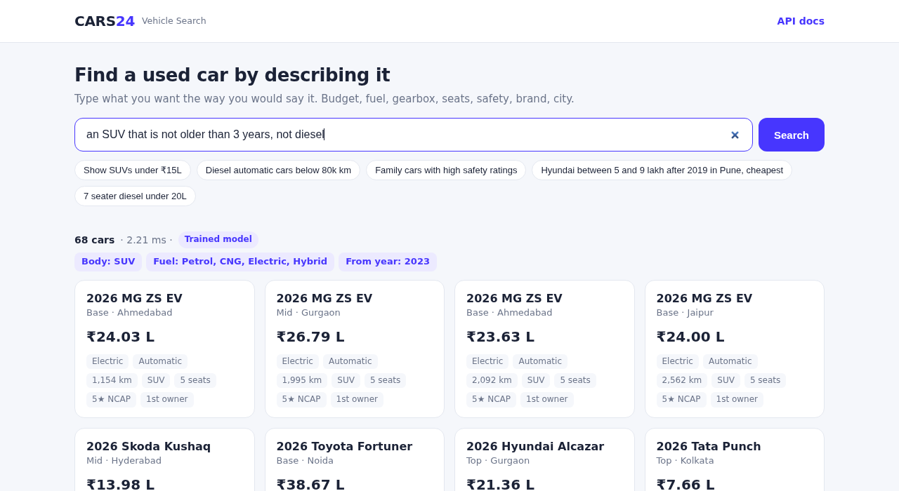
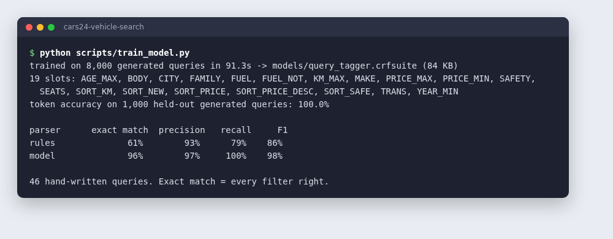

# Cars24 Vehicle Search

Search a used-car catalogue in plain English.

```
GET /search?q=Diesel automatic cars below 80k km

filters  → fuel: Diesel, gearbox: Automatic, max km: 80,000
results  → 54 matching cars, newest first
```

Built for the Cars24 Backend Engineering assignment, **Problem 2: AI Vehicle Search Engine**. The service turns a free-text query into structured filters, runs them against the catalogue, and returns matching cars along with the filters it understood.


**Stack:** Python 3.10+, FastAPI, SQLite, a CRF model we trained ourselves (python-crfsuite), Anthropic Claude API (optional), optional Redis.

---

## At a glance

### What makes it stand out

- **The AI only reads the query.** The LLM turns the query into a typed set of filters, and a parameterised SQL query does the actual search. A car over budget can never show up, the LLM never touches SQL, and every response includes the filters so you can see how the query was read.
- **It has its own trained model.** Besides the LLM, the project includes a query-understanding model we trained ourselves. It runs locally in under a millisecond, costs nothing per query, and needs no network. On a set of hand-written test queries it gets **96%** of queries fully right, against **61%** for the rule parser.
- **It works without an API key.** The parsers are tried in order: the LLM, then the trained model, then the rules. If one is unavailable or fails, the next one takes over and the search still succeeds.
- **It doesn't return empty pages.** If nothing matches exactly, it drops the least important filters one at a time (safety rating, then km, then year) and says which ones it dropped. Budget, fuel, body type, brand and city are never dropped.
- **It is measured at scale.** A benchmark script runs every example query against a 1,000,000-car catalogue (p95 94 ms uncached, about 6 ms cached).
- **It is ready to deploy.** It ships with a Dockerfile, health check, structured config, 21 tests and a search page you can try in the browser.

### How it scales

| Layer | What it does | Effect |
|---|---|---|
| Cache | Stores parsed queries, counts and result pages, in memory or in Redis shared across instances | A repeated search skips the LLM and the database |
| Query planning | For broad searches, reads rows straight from an index that is already in the requested sort order and stops after one page | A search that used to sort 508k rows to return 20 now reads about 20 |
| Counting | Stops counting at 10,000 and reports "10,000+" | Removes the most expensive part of broad searches |
| Paging | A cursor continues from the end of the previous page instead of skipping rows with OFFSET | Page 500 costs about the same as page 1 |
| Serving | Keeps no state between requests, runs several workers, uses read-only connections | Add instances behind a load balancer to handle more traffic |

### Future scope

- **Postgres or OpenSearch** in place of SQLite for multi-million-listing catalogues, facets (counts per brand or fuel) and fuzzy matching on model names. All SQL is in one file, so this swap only touches that file.
- **Lower LLM cost through distillation.** Label real search logs with the LLM, retrain our own model on them, and send a query to the LLM only when the trained model is unsure. A semantic cache would let paraphrased queries reuse the same result.
- **A bigger trained model.** Fine-tune a small transformer (for example DistilBERT for tagging, or T5 to output the filters directly) once there are enough labelled real queries. See [Trained model](#our-own-trained-model).
- **Vague intent** ("sporty", "good for highways"). Re-rank cars within the filtered results using listing tags or embeddings, so budget and fuel limits still apply.
- **Richer filters.** Search by model name ("XUV700") and explicit exclusions for more than fuel.
- **Quality tracking.** Grow the hand-written test set from real queries, and score all three parsers on it every time the prompt, the model or the rules change (`make eval` already does this).

Details: [Scalability](#scalability) and [docs/DESIGN.md](docs/DESIGN.md).

---

## Contents

- [Three ways to parse a query](#three-ways-to-parse-a-query)
- [Our own trained model](#our-own-trained-model)
- [How to run](#how-to-run)
- [How to search](#how-to-search)
- [API](#api)
- [Scalability](#scalability)
- [Project structure](#project-structure)
- [Configuration](#configuration)
- [Docker and deployment](#docker-and-deployment)
- [Tests](#tests)

---

## Three ways to parse a query

The hard part of this problem is understanding the query. The service has three parsers. They are tried in this order, and the first one available handles the query:

| | **1. AI parser (LLM)** | **2. Trained model (ours)** | **3. Rule parser** |
|---|---|---|---|
| Needs | `ANTHROPIC_API_KEY` | The model file (included in the repo) | Nothing |
| How it works | Claude reads the query and returns filters that are validated against a fixed schema | A CRF sequence tagger we trained labels each word with the filter it belongs to | Regular expressions for common phrasings |
| Speed and cost | About 1 s and a small API cost per new query (cached afterwards) | About 0.4 ms, free, works offline | About 0.1 ms, free |
| Best at | Anything: unusual phrasing, vague requests, typos | Everyday queries, including negation, number words, "family of 7", "1.2 lakh km" and city nicknames | Standard formats such as "under 15L", "80k km", "7 seater" |
| Used when | A key is set | No key, or the LLM call failed | Last-resort fallback |

> **For the best results, set an API key.** Without a key the trained model handles queries, and it does a lot better than the rules (see below). The response field `parser` (`llm`, `model` or `rules`) and the badge in the UI show which parser handled each query. Set `PARSER=model` to skip the LLM, or `PARSER=rules` to use only the rules.

These are real outputs for queries the rule parser gets wrong:

| Query | Rule parser | Trained model | What the query means |
|---|---|---|---|
| an SUV that is not older than 3 years, not diesel | SUV, **Diesel** | SUV, year ≥ 2023, Petrol/CNG/Electric/Hybrid | SUV, year ≥ 2023, any fuel except diesel |
| Maruti or Toyota automatic, max 1.2 lakh km | Maruti/Toyota, automatic, **max price ₹1.2L** | Maruti/Toyota, automatic, max 120,000 km | Maruti/Toyota, automatic, max 120,000 km |
| something for a family of 7 that runs on diesel, budget twelve lakh | Diesel, **5+ seats**, sorted by price, no budget | Diesel, 7+ seats, family body types, max ₹12L | Diesel, 7+ seats, max ₹12L |
| a car my wife can drive easily, no gears please | *(nothing)* | Automatic, **plus 5+ seats** (it took "wife" to mean a family car) | Automatic |

The trained model reading the first query:



The AI parser is given the same conventions (1L = ₹1,00,000, "family car" = 5+ seats, "safe" = 4+ NCAP stars and so on). Because it reads the whole sentence rather than matching keywords or patterns it has seen, it is the most flexible of the three. Whichever parser runs, it only produces filters. None of them writes SQL or decides what is in the results (see [docs/DESIGN.md](docs/DESIGN.md)).

---

## Our own trained model

### What it is

A **CRF (conditional random field) sequence tagger**. This is a classic model for this kind of query-understanding task, and voice assistants used it for slot filling before LLMs. It reads the query word by word and labels each word with the filter it fills:

```
not   diesel      under  12           lakh         1.2       lakh       km
O     B-FUEL_NOT  O      B-PRICE_MAX  I-PRICE_MAX  B-KM_MAX  I-KM_MAX   O
```

Each word is labelled from its context: the word itself, its shape (year, decimal, number word), whether it is a known brand, city or unit, and the three words on each side. So the model learns that "1.2 lakh" followed by "km" is a distance and "diesel" after "not" is an exclusion. A small, readable function then turns the labelled spans into filters (number words, lakh/crore/k units, aliases such as Bengaluru, Gurugram and Bombay).

It recognises 19 slot types: body, fuel, excluded fuel, gearbox, make, city, min/max price, max km, min year, max age, seats, safety, family, and five sort orders.

### How it was trained

1. **Data.** `training/generate.py` builds labelled queries from slot phrases ("under 15 lakh", "for a family of 7", "not diesel", "1.2 lakh km"), mixed in random order with filler words ("show me", "please", "for daily commute"). 8,000 queries are used for training.
2. **Training.** `scripts/train_model.py` trains the CRF (L1 and L2 regularisation, 200 iterations) on a laptop CPU in about 1.5 minutes. The model file is 84 KB and is committed in `models/`, so nobody has to train it before running the app.
3. **Evaluation.** `training/eval_queries.jsonl` holds 46 hand-written queries with their expected filters. They are written separately from the templates and are never used for training. Every parser is scored on them.

```bash
python scripts/train_model.py                 # retrain (make train)
python -m training.evaluate --show-errors     # compare parsers, list mistakes (make eval)
```



| Parser | Queries fully right | Precision | Recall | F1 |
|---|---|---|---|---|
| Rules | 61% | 93% | 79% | 86% |
| **Trained model** | **96%** | **97%** | **100%** | **98%** |

*Precision, recall and F1 are measured over individual filters. "Fully right" means every filter for the query is correct.*

The two queries it still gets wrong are listed above and by `--show-errors`: "my wife" gets read as a family car, and "i20" (a car model) gets read as a ₹20L budget.

**To be clear about the numbers:** the test queries and the training templates were written by the same person, so this test set is friendlier than real traffic will be. Treat the scores as a comparison between parsers, not as production accuracy. The way to get a trustworthy number is to collect real queries, label them (the LLM parser can do the first pass), and add them to both the test set and the training data. The training script and the test file already use that format.

### Why a CRF and not a neural network

| | CRF (this repo) | Fine-tuned transformer (DistilBERT, T5) |
|---|---|---|
| Training | 1.5 min on CPU | Needs a GPU, or hours on CPU |
| Size | 84 KB | 250 MB or more |
| Inference | 0.4 ms on CPU | 10 to 50 ms on CPU |
| Dependencies | `python-crfsuite` | PyTorch, transformers |
| Unseen phrasing | Weaker | Stronger |

For a search box that has to answer in milliseconds, the CRF is the better trade today. Once there are a few thousand labelled real queries, fine-tuning a small transformer on the same data is the natural next step. The data format, evaluation script and parser interface would stay the same.

---

## How to run

### 1. Install

```bash
git clone git@github.com:Ashutoshpandey29/CARS-24-AI-VEHICLE-SEARCH-.git
cd CARS-24-AI-VEHICLE-SEARCH-
python3 -m venv .venv
source .venv/bin/activate
pip install -r requirements-dev.txt
```

### 2. Create the catalogue

```bash
python scripts/seed.py            # 600 cars into data/cars.db
```

The generator is deterministic. It uses 41 real models from 11 brands, with real body types, seat counts, fuel and gearbox options and NCAP ratings, spread over 11 cities with matching registration plates. Prices start from each model's ex-showroom price and depreciate with age, mileage, variant, fuel and gearbox. Pass a number for a bigger catalogue, e.g. `python scripts/seed.py 1000000`.

### 3. Turn on the AI parser (recommended)

```bash
cp .env.example .env
# open .env and set ANTHROPIC_API_KEY=sk-ant-...
```

If you skip this step, the trained model handles queries, with the rules as backup. The trained model is already in the repo, so there is nothing to train first. To retrain it, run `python scripts/train_model.py`.

### 4. Start the server

```bash
uvicorn app.main:app --reload --env-file .env    # or without --env-file if you skipped step 3
```

If port 8000 is taken, add `--port 8002` (or any free port) and use that port in the URLs below.

### 5. Open it

| URL | What it is |
|---|---|
| http://localhost:8000 | Search page |
| http://localhost:8000/docs | Interactive API docs (Swagger) |
| http://localhost:8000/health | Health check, also shows which parser is active |

Seeding, tests and server start in one terminal:


The `Makefile` has shortcuts for the same steps: `make install`, `make seed`, `make run`, `make test`, `make train`, `make eval`, `make bench`, `make docker`.

---

## How to search

### Search page

Open http://localhost:8000, type a query or click an example. The page shows:

- how many cars matched and how long the search took
- which parser handled the query (**AI parser**, **Trained model** or **Rule parser**)
- the filters it understood, as chips under the result count
- the cars, with **Show more** at the bottom for the next page


When nothing matches exactly, the service drops the least important filters one at a time and tells you which ones it dropped. Here the only Renault hatchback (the Kwid) has a 1-star rating, so the 5-star requirement was relaxed:


Budget, fuel, body type, make and city are never relaxed. Only safety rating, km driven and year are, in that order.

### Swagger UI

Open http://localhost:8000/docs, click **GET /search**, then **Try it out**, type a query in `q` and press **Execute**.


### curl

```bash
curl -s -G localhost:8000/search --data-urlencode "q=7 seater diesel under 20L" -d limit=2 | python -m json.tool
```


### Queries to try

| Query | Filters it produces |
|---|---|
| Show SUVs under ₹15L | body SUV, max price ₹15L |
| Diesel automatic cars below 80k km | fuel Diesel, automatic, max 80,000 km |
| Family cars with high safety ratings | 5+ seats, SUV/MUV/Sedan, 4+ NCAP stars |
| Hyundai between 5 and 9 lakh after 2019 in Pune, cheapest | Hyundai, ₹5L to ₹9L, year ≥ 2019, Pune, cheapest first |
| 7 seater diesel under 20L | 7+ seats, Diesel, max price ₹20L |

---

## API

### `GET /search`

| Param | Type | Notes |
|---|---|---|
| `q` | string, 2 to 300 chars, required | The query |
| `limit` | int, 1 to 100, default 20 | Page size |
| `cursor` | string, optional | `next_cursor` from the previous response. Use this for paging. |
| `offset` | int, 0 to 10,000, default 0 | Simple paging for shallow pages |

Response fields:

| Field | Meaning |
|---|---|
| `parser` | `llm`, `model` or `rules` |
| `filters` | The structured version of the query. Useful for checking why a car did or did not show up. |
| `relaxed` | Filters dropped because the strict search found nothing |
| `total`, `total_exact` | Number of matches. Counting stops at 10,000 (`COUNT_CAP`); past that `total_exact` is `false` and the UI shows "10,000+". |
| `next_cursor` | Pass as `cursor` to get the next page. `null` on the last page. |
| `took_ms` | Server-side time for the search |
| `results` | The cars |

### `GET /cars/{id}`

One car. `404` if the id does not exist.

### `GET /health`

`{"status": "ok", "parser": "model", "fallbacks": ["rules"]}`: the parser that handles queries first, then its fallbacks in order. Returns `503` if the database is unreachable.

Bad input (query too short or too long, limit over 100, malformed cursor) returns `422` or `400` with a message.

---

## Scalability

The original version opened a new database connection per request, counted every match exactly, and let SQLite sort all matching rows before returning 20. That was fine for 600 cars but slow at catalogue scale. These are the changes, all included in this repo:

| Change | Why it matters |
|---|---|
| **Two-level cache** (parsed query, then count and page) | Popular searches repeat a lot. A repeated query skips the LLM call and the database entirely. Parses from the first-choice parser are kept for a day. Results from a fallback are kept for 5 minutes, so queries that fell back during an LLM outage get retried with the LLM soon. |
| **Redis support** (`REDIS_URL`) | The default cache lives in each process. With several workers or servers, Redis gives them one shared cache, so a query parsed once is parsed for everyone. If Redis is down, searches still work without the cache. |
| **Cache invalidation on reseed** | Cache keys include the catalogue file's modification time, so loading new data never serves stale results. |
| **Index walk for broad queries** | When a query matches 1% or more of the catalogue, rows are read straight from an index that is already in the requested sort order, and reading stops after one page. Before this, "SUVs under 15L" on 1M cars sorted 508k rows to return 20 (470 ms). Now it takes under 1 ms. |
| **Indexes matched to the filters** | `(body_type, price)`, `(fuel_type, transmission, price)`, `(make, price)`, `(city, price)`, plus one index per sort order. `ANALYZE` runs after seeding so SQLite's query planner has row statistics. |
| **Capped counts** | Counting 500k matches exactly takes hundreds of ms and nobody pages through them. Counting stops at 10,000 and the API reports `10,000+`. |
| **Cursor (keyset) pagination** | `OFFSET 5000` makes the database read and discard 5,000 rows. A cursor jumps straight to where the last page ended, so page 500 costs about the same as page 1. |
| **Persistent read-only connections** | One connection per worker thread, opened read-only, with memory-mapped I/O and a 64 MB page cache. No connection setup per request. |
| **Multiple workers** | The Docker image runs `WEB_CONCURRENCY` uvicorn workers (default 4). The API keeps no state between requests, so you can add instances behind a load balancer. |
| **Batched seeding** | 1M cars load in about 25 s: inserts go in batches of 50k, and indexes are built after the inserts. |

### Benchmark: 1,000,000 cars

Run it yourself with `make bench` or `python scripts/benchmark.py --count 1000000`.


| | Before (exact counts, sort every match) | After |
|---|---|---|
| Uncached search, p50 | 154 ms | **53 ms** |
| Uncached search, p95 | 517 ms | **94 ms** |
| Cached search, p50 | 5 ms | 6 ms |
| Page at result ~5,000 | 653 ms | **19 ms** (cursor) |

Measured on a laptop through the full HTTP stack (FastAPI test client), with the rule parser. The trained model adds about 0.4 ms per new query. With the AI parser, the first time a query is seen adds roughly one LLM round trip. After that it comes from the cache.

### Going further

When one machine is no longer enough, the code is set up so each step is a small change:

1. **Postgres or Elasticsearch/OpenSearch** in place of SQLite. All SQL is in `app/search/query.py`, so only that file changes. OpenSearch also adds facets (counts per brand, per fuel) and fuzzy matching on model names.
2. **Read replicas.** The API only reads, so it scales horizontally against replicas.
3. **Trained model first, LLM second.** The CRF reports how confident it is in its labels. Send a query to the LLM only when that confidence is low, which cuts LLM calls for everyday queries.
4. **Semantic cache.** Store query embeddings so paraphrases ("SUV below 15 lakh" and "15L budget SUV") hit the same cache entry.

More detail on the design and trade-offs is in [docs/DESIGN.md](docs/DESIGN.md).

---

## Project structure

```
app/
  main.py            FastAPI app, middleware, search page route
  config.py          Settings from environment variables
  db.py              Read-only SQLite connections, one per thread
  cache.py           In-memory LRU or Redis, both with TTL
  schemas.py         Filters, Car and SearchResponse models
  vocab.py           Brands, cities, body/fuel types shared everywhere
  api/routes.py      /search, /cars/{id}, /health
  parser/
    __init__.py      parse(): cache, then LLM > trained model > rules
    llm.py           Claude structured-output parser
    model.py         Our trained CRF tagger: features, decoding to filters
    rules.py         Regex parser
  search/
    query.py         Filters to parameterised SQL, sort orders, cursors
    service.py       Search flow: count, relax, fetch, cache
  static/index.html  Search page
models/
  query_tagger.crfsuite   Trained model (84 KB)
training/
  generate.py        Builds labelled training queries
  eval_queries.jsonl 46 hand-written test queries, never used for training
  evaluate.py        Scores parsers on the test queries
scripts/
  seed.py            Catalogue generator
  train_model.py     Trains and evaluates the model
  benchmark.py       Latency benchmark on a large catalogue
tests/               Parser, model and API tests
docs/                Design notes and screenshots
Dockerfile, Makefile, requirements.txt, requirements-dev.txt, .env.example
```

---

## Configuration

All settings are environment variables (see `.env.example`).

| Variable | Default | Purpose |
|---|---|---|
| `ANTHROPIC_API_KEY` | unset | Turns on the AI parser |
| `PARSER` | `auto` | Where the parser chain starts: `auto`/`llm` (LLM > model > rules), `model` (model > rules) or `rules` |
| `MODEL_PATH` | `models/query_tagger.crfsuite` | Trained model file |
| `LLM_MODEL` | `claude-opus-5-5` | Model used for parsing |
| `LLM_TIMEOUT` | `20` | Seconds before falling back to the next parser |
| `DB_PATH` | `data/cars.db` | SQLite file |
| `REDIS_URL` | unset | Shared cache, e.g. `redis://localhost:6379/0` (needs `pip install redis`) |
| `CACHE_SIZE` | `10000` | Entries in the in-memory cache |
| `PARSE_CACHE_TTL` | `86400` | Seconds to keep parses from the first-choice parser (fallback results are kept for 5 minutes) |
| `RESULT_CACHE_TTL` | `60` | Seconds to keep counts and pages |
| `COUNT_CAP` | `10000` | Stop counting matches here. `0` means always count exactly. |
| `LOG_LEVEL` | `INFO` | |

---

## Docker and deployment

```bash
docker build -t cars24-vehicle-search .
docker run -p 8000:8000 -e ANTHROPIC_API_KEY=sk-ant-... cars24-vehicle-search
```

The image seeds 600 cars at build time (`--build-arg SEED_COUNT=100000` for more), runs as a non-root user, has a health check, and starts 4 workers.

GitHub stores the code but cannot run a Python server. To get a public URL, connect this repo to Render, Railway, Fly.io or similar:

- **Build:** `pip install -r requirements.txt && python scripts/seed.py`
- **Start:** `uvicorn app.main:app --host 0.0.0.0 --port $PORT`
- **Env:** `ANTHROPIC_API_KEY`

Or point the platform at the Dockerfile.

---

## Tests

```bash
pytest -q
```

21 tests cover:
- the rule parser and the trained model, including a check that fails if a retrained model scores below 90% on the test queries or no better than the rules
- filtering and relaxation
- cursor paging (cursor pages must match offset pages exactly) and cursor validation
- input validation, car lookup and the search page

Tests never call the LLM, so they are deterministic and need no network access or API key.
